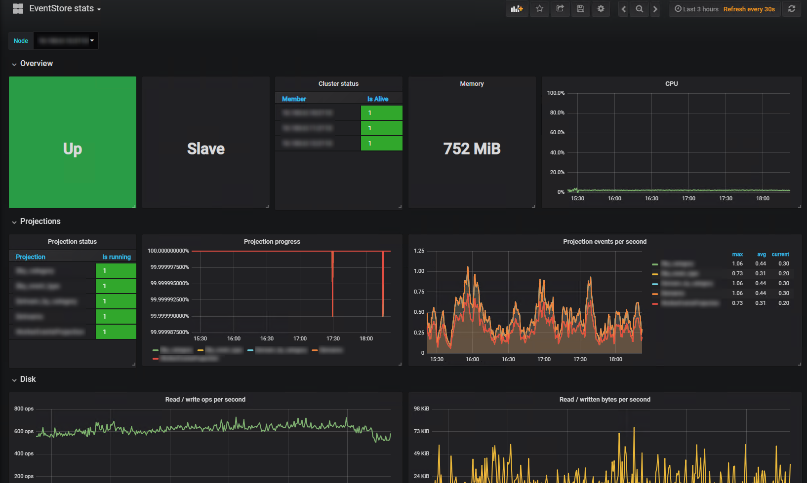

# EventStoreDB Prometheus exporter

[](https://goreportcard.com/report/github.com/marcinbudny/eventstore_exporter)
[](https://github.com/marcinbudny/eventstore_exporter/actions/workflows/main.yml)

EventStoreDB (<https://eventstore.com/eventstoredb/>) metrics Prometheus exporter.

## Installation

### Using binaries

Download latest binaries from the [releases page](https://github.com/marcinbudny/eventstore_exporter/releases).

```bash
eventstore_exporter \
    --eventstore-url=https://my-eventstore:2113 \
    --eventstore-user=admin \
    --eventstore-password=changeit \
    --cluster-mode=single \
    --enable-parked-messages-stats
```

### Using Docker

```bash
docker run -d -p 9448:9448 \
    -e EVENTSTORE_URL=https://my-eventstore:2113 \
    -e CLUSTER_MODE=single \
    -e EVENTSTORE_USER=admin \
    -e EVENTSTORE_PASSWORD=changeit \
    -e ENABLE_PARKED_MESSAGES_STATS=True \
    marcinbudny/eventstore_exporter
```

### From source

You need to have a Go 1.20+ environment configured.

```bash
go install github.com/marcinbudny/eventstore_exporter@latest

eventstore_exporter \
    --eventstore-url=https://my-eventstore:2113 \
    --eventstore-user=admin \
    --eventstore-password=changeit \
    --cluster-mode=single \
    --enable-parked-messages-stats
```

### Supported EventStoreDB versions

- 20.10 LTS
- 21.10 LTS
- 22.10 LTS

Other versions may also work but are not tested.

### Unsupported versions

- 5.0 (last supported in exporter version v0.10.4)

## Configuration

The exporter can be configured with command line arguments, environment variables and a configuration file. For the details on how to format the configuration file, visit [namsral/flag](https://github.com/namsral/flag) repo.

| Flag                           | ENV variable                 | Default                 | Meaning                                                                                                                                                                                                                                                                                                                                                                   |
| ------------------------------ | ---------------------------- | ----------------------- | ------------------------------------------------------------------------------------------------------------------------------------------------------------------------------------------------------------------------------------------------------------------------------------------------------------------------------------------------------------------------- |
| --config                       |                              |                         | Path to config file (optional)                                                                                                                                                                                                                                                                                                                                            |
| --eventstore-url               | EVENTSTORE_URL               | <http://localhost:2113> | EventStoreDB HTTP endpoint                                                                                                                                                                                                                                                                                                                                                |
| --eventstore-user              | EVENTSTORE_USER              | (empty)                 | EventStoreDB user (if not specified, basic auth is not used)                                                                                                                                                                                                                                                                                                              |
| --eventstore-password          | EVENTSTORE_PASSWORD          | (empty)                 | EventStoreDB password (if not specified, basic auth is not used)                                                                                                                                                                                                                                                                                                          |
| --cluster-mode                 | CLUSTER_MODE                 | cluster                 | Set to 'single' when monitoring a single node instance, set to 'cluster' when monitoring a cluster node. This settings decides whether gossip stats endpoint is queried. **Note:** Starting with ES 21.2, the gossip endpoint responds to queries even for single node installation. So if using this version, you can ignore this setting and leave it at default value. |
| --port                         | PORT                         | 9448                    | Port to expose scrape endpoint on                                                                                                                                                                                                                                                                                                                                         |
| --timeout                      | TIMEOUT                      | 10s                     | Timeout for the scrape operation                                                                                                                                                                                                                                                                                                                                          |
| --verbose                      | VERBOSE                      | false                   | Enable verbose logging                                                                                                                                                                                                                                                                                                                                                    |
| --insecure-skip-verify         | INSECURE_SKIP_VERIFY         | false                   | Skip TLS certificate verification for EventStore HTTP client                                                                                                                                                                                                                                                                                                              |
| --enable-parked-messages-stats | ENABLE_PARKED_MESSAGES_STATS | false                   | Enable parked messages stats scraping.                                                                                                 |
| --streams                      | STREAMS                      | (empty)                 | List of streams to get stats for e.g. `$all,my-stream`. Currently last event position / last event number is the only supported metric.                                                                                                                                                                                                                                   |
| --streams-separator            | STREAMS_SEPARATOR            | `,`                     | Single character separator for streams list provided in `--streams`. Change from default if your stream names contain commas.                                                                                                                                                                                                                                             |
| --enable-tcp-connection-stats  | ENABLE_TCP_CONNECTION_STATS  | false                   | Enable scraping of TCP connection stats (connections between nodes in the cluster, TCP client connections, excluding gRPC)                                                                                                                                                                                                                                                |


Sample configuration file

```text
eventstore-url=http://localhost:2113
port=8888
verbose
```

To run with configuration file:

```bash
./eventstore_exporter --config my_config_file
```

## Grafana dashboard

Can be found [here](https://grafana.com/dashboards/7673)



## Exported metrics

Let me know if there is a metric you would like to be added.

```text
# HELP eventstore_cluster_member_alive If 1, cluster member is alive, as seen from current cluster member
# TYPE eventstore_cluster_member_alive gauge
eventstore_cluster_member_alive{member="172.16.1.11:2113"} 1

# HELP eventstore_cluster_member_is_clone If 1, current cluster member is a clone
# TYPE eventstore_cluster_member_is_clone gauge
eventstore_cluster_member_is_clone 1

# HELP eventstore_cluster_member_is_follower If 1, current cluster member is a follower
# TYPE eventstore_cluster_member_is_follower gauge
eventstore_cluster_member_is_follower 0

# HELP eventstore_cluster_member_is_leader If 1, current cluster member is the leader
# TYPE eventstore_cluster_member_is_leader gauge
eventstore_cluster_member_is_leader 0

# HELP eventstore_cluster_member_is_readonly_replica If 1, current cluster member is a readonly replica
# TYPE eventstore_cluster_member_is_readonly_replica gauge
eventstore_cluster_member_is_readonly_replica 0

# HELP eventstore_disk_io_read_bytes Total number of disk IO read bytes
# TYPE eventstore_disk_io_read_bytes gauge
eventstore_disk_io_read_bytes 20480

# HELP eventstore_disk_io_read_ops Total number of disk IO read operations
# TYPE eventstore_disk_io_read_ops gauge
eventstore_disk_io_read_ops 2814

# HELP eventstore_disk_io_write_ops Total number of disk IO write operations
# TYPE eventstore_disk_io_write_ops gauge
eventstore_disk_io_write_ops 4421

# HELP eventstore_disk_io_written_bytes Total number of disk IO written bytes
# TYPE eventstore_disk_io_written_bytes gauge
eventstore_disk_io_written_bytes 2.6918912e+08

# HELP eventstore_drive_available_bytes Drive available bytes
# TYPE eventstore_drive_available_bytes gauge
eventstore_drive_available_bytes{drive="/var/lib/eventstore"} 5.6815230976e+10

# HELP eventstore_drive_total_bytes Drive total size in bytes
# TYPE eventstore_drive_total_bytes gauge
eventstore_drive_total_bytes{drive="/var/lib/eventstore"} 6.2725787648e+10

# HELP eventstore_process_cpu Process CPU usage, 0 - number of cores
# TYPE eventstore_process_cpu gauge
eventstore_process_cpu 0.08

# HELP eventstore_process_memory_bytes Process memory usage, as reported by EventStore
# TYPE eventstore_process_memory_bytes gauge
eventstore_process_memory_bytes 1.19267328e+08

# HELP eventstore_projection_events_processed_after_restart_total Projection event processed count after restart
# TYPE eventstore_projection_events_processed_after_restart_total counter
eventstore_projection_events_processed_after_restart_total{projection="$by_event_type"} 0

# HELP eventstore_projection_progress Projection progress 0 - 1, where 1 = projection progress at 100%
# TYPE eventstore_projection_progress gauge
eventstore_projection_progress{projection="$by_event_type"} 1

# HELP eventstore_projection_running If 1, projection is in 'Running' state
# TYPE eventstore_projection_running gauge
eventstore_projection_running{projection="$by_event_type"} 1

# HELP eventstore_projection_status If 1, projection is in specified state
# TYPE eventstore_projection_status gauge
eventstore_projection_status{projection="$by_event_type",status="Faulted"} 0
eventstore_projection_status{projection="$by_event_type",status="Running"} 1
eventstore_projection_status{projection="$by_event_type",status="Stopped"} 0

# HELP eventstore_queue_items_processed_total Total number items processed by queue
# TYPE eventstore_queue_items_processed_total counter
eventstore_queue_items_processed_total{queue="index Committer"} 54

# HELP eventstore_queue_length Queue length
# TYPE eventstore_queue_length gauge
eventstore_queue_length{queue="index Committer"} 0

# HELP eventstore_stream_last_commit_position Last commit position in a stream ($all stream only)
# TYPE eventstore_stream_last_commit_position gauge
eventstore_stream_last_commit_position{event_stream_id="$all"} 36169

# HELP eventstore_stream_last_event_number Last event number in a stream (streams other than $all)
# TYPE eventstore_stream_last_event_number gauge
eventstore_stream_last_event_number{event_stream_id="my-stream"} 7

# HELP eventstore_subscription_connections Number of connections to subscription
# TYPE eventstore_subscription_connections gauge
eventstore_subscription_connections{event_stream_id="test-stream",group_name="group1"} 0

# HELP eventstore_subscription_items_processed_total Total items processed by subscription
# TYPE eventstore_subscription_items_processed_total counter
eventstore_subscription_items_processed_total{event_stream_id="test-stream",group_name="group1"} 24

# HELP eventstore_subscription_last_known_event_number Last known event number in subscription
# TYPE eventstore_subscription_last_known_event_number gauge
eventstore_subscription_last_known_event_number{event_stream_id="test-stream",group_name="group1"} 23

# HELP eventstore_subscription_last_checkpointed_event_commit_position Last checkpointed event's commit position ($all stream only)
# TYPE eventstore_subscription_last_checkpointed_event_commit_position gauge
eventstore_subscription_last_checkpointed_event_commit_position{event_stream_id="$all",group_name="group1"} 43950

# HELP eventstore_subscription_last_known_event_commit_position Last known event's commit position ($all stream only)
# TYPE eventstore_subscription_last_known_event_commit_position gauge
eventstore_subscription_last_known_event_commit_position{event_stream_id="$all",group_name="group1"} 47509

# HELP eventstore_subscription_last_known_event_number Last known event number in subscription (streams other than $all)
# TYPE eventstore_subscription_last_known_event_number gauge
eventstore_subscription_last_known_event_number{event_stream_id="test-stream",group_name="group1"} 251

# HELP eventstore_subscription_last_processed_event_number Last event number processed by subscription (streams other than $all)
# TYPE eventstore_subscription_last_processed_event_number gauge
eventstore_subscription_last_processed_event_number{event_stream_id="test-stream",group_name="group1"} 95

# HELP eventstore_subscription_oldest_parked_message_age_seconds Oldest parked message age for subscription in seconds
# TYPE eventstore_subscription_oldest_parked_message_age_seconds gauge
eventstore_subscription_oldest_parked_message_age_seconds{event_stream_id="test-stream",group_name="group1"} 33

# HELP eventstore_subscription_parked_messages Number of parked messages for subscription
# TYPE eventstore_subscription_parked_messages gauge
eventstore_subscription_parked_messages{event_stream_id="test-stream",group_name="group1"} 1

# HELP eventstore_tcp_connections Current number of TCP connections
# TYPE eventstore_tcp_connections gauge
eventstore_tcp_connections 1

# HELP eventstore_tcp_received_bytes TCP received bytes
# TYPE eventstore_tcp_received_bytes gauge
eventstore_tcp_received_bytes 17237

# HELP eventstore_tcp_sent_bytes TCP sent bytes
# TYPE eventstore_tcp_sent_bytes gauge
eventstore_tcp_sent_bytes 3423

# HELP eventstore_tcp_connection_pending_received_bytes TCP connection pending received bytes
# TYPE eventstore_tcp_connection_pending_received_bytes gauge
eventstore_tcp_connection_pending_received_bytes{client_name="ES-8d3d28dd-7944-49b4-a130-686cc9aecc92",external="true",id="7d7f9762-9565-4cca-8bdf-2dc7c845c19a",local_endpoint="172.16.1.11:1113",remote_endpoint="172.16.1.1:59230",ssl="false"} 0

# HELP eventstore_tcp_connection_pending_send_bytes TCP connection pending send bytes
# TYPE eventstore_tcp_connection_pending_send_bytes gauge
eventstore_tcp_connection_pending_send_bytes{client_name="ES-8d3d28dd-7944-49b4-a130-686cc9aecc92",external="true",id="7d7f9762-9565-4cca-8bdf-2dc7c845c19a",local_endpoint="172.16.1.11:1113",remote_endpoint="172.16.1.1:59230",ssl="false"} 0

# HELP eventstore_tcp_connection_received_bytes TCP connection total received bytes
# TYPE eventstore_tcp_connection_received_bytes counter
eventstore_tcp_connection_received_bytes{client_name="ES-8d3d28dd-7944-49b4-a130-686cc9aecc92",external="true",id="7d7f9762-9565-4cca-8bdf-2dc7c845c19a",local_endpoint="172.16.1.11:1113",remote_endpoint="172.16.1.1:59230",ssl="false"} 398542

# HELP eventstore_tcp_connection_sent_bytes TCP connection total sent bytes
# TYPE eventstore_tcp_connection_sent_bytes counter
eventstore_tcp_connection_sent_bytes{client_name="ES-8d3d28dd-7944-49b4-a130-686cc9aecc92",external="true",id="7d7f9762-9565-4cca-8bdf-2dc7c845c19a",local_endpoint="172.16.1.11:1113",remote_endpoint="172.16.1.1:59230",ssl="false"} 252635

# HELP eventstore_up Whether the EventStore scrape was successful
# TYPE eventstore_up gauge
eventstore_up 1
```
